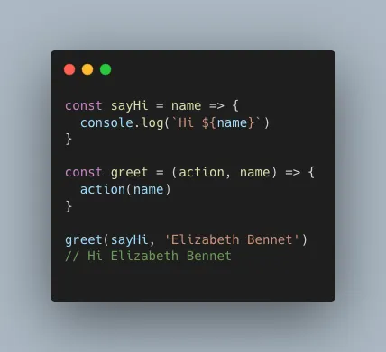

# ¿Qué es Heroku? existen otras alternativas? hazme una tabla si existen similares con los beneficios y desventajas


## ¿Qué es Heroku?

Heroku es una plataforma como servicio ampliamente utilizada que permite a los desarrolladores implementar, escalar y administrar aplicaciones rápidamente.

Esta plataforma ofrece soporte para una amplia gama de lenguajes de programación como Java, Ruby, PHP, Node.js, Python, Scala y Clojure. Heroku ejecuta aplicaciones a través de contenedores virtuales, más conocidos como Dynos.

Heroku cobra a sus usuarios en función de los recursos informáticos como la RAM y las máquinas virtuales dedicadas. La plataforma Heroku y las aplicaciones creadas por los usuarios utilizan Amazon Web Services como infraestructura subyacente. Los desarrolladores pueden crear aplicaciones muy rápidamente utilizando este marco, ya que es bastante fácil de usar y fácil de usar.

Un servicio PaaS como Heroku proporciona un servicio totalmente administrado, resuelve problemas de infraestructura y puede aumentar o reducir automáticamente la cantidad de servidores. En comparación con un proveedor de IaaS puro, proporciona capas adicionales de valor además de los recursos de la máquina virtual.

## ¿Para qué se utiliza Heroku?

Los desarrolladores y las empresas pueden utilizar Heroku para una variedad de aplicaciones, que incluyen:

- Lanzamiento de contenedores inteligentes
- Escalado de aplicaciones
- Bases de datos administradas
- Plataformas de IoT
- Aplicaciones Web

## Beneficios de Heroku

A continuación se detallan algunos de los beneficios de Heroku.

- ### Inicio gratuito

Los usuarios pueden comenzar con el nivel gratuito de Heroku, que sin embargo tiene algunas limitaciones y funcionalidades básicas. Este es un plan adecuado para aquellos que buscan crear una aplicación básica en la nube.

Los desarrolladores pueden elegir este plan tarifario durante la fase de inicio antes de utilizar la plataforma. Puede usarlo para probar las capacidades de Heroku y determinar si es adecuado para sus aplicaciones.

- ### Facilidad de uso

Como plataforma líder como servicio, Heroku es conocida por su facilidad de uso. Los desarrolladores pueden elegir entre varios paquetes de niveles diferentes que se adaptan mejor a los complejos requisitos de las grandes empresas.

El panel intuitivo de la plataforma Heroku ayuda a los usuarios a escalar, administrar y monitorear aplicaciones fácilmente.

- ### Centrarse en los desarrolladores

Heroku se centra en ayudar a los desarrolladores a mejorar sus habilidades para crear aplicaciones ricas en funciones. Los desarrolladores disfrutan utilizando este entorno porque obtienen acceso a valiosas herramientas que ayudan a acelerar los procesos de desarrollo centrales.

Están libres de tareas repetitivas y pueden centrarse en actividades críticas de desarrollo. Las poderosas capacidades de Heroku pueden dar vida a cualquier proyecto de desarrollo de aplicaciones.

- ### Permite a los desarrolladores centrarse en escribir código en lugar de administrar servidores.

Heroku elimina la carga de la administración del servidor de los desarrolladores y les brinda acceso a una interfaz web fácil de usar. La implementación con un solo clic también es bastante conveniente para los desarrolladores después de iniciar la aplicación.

Pueden crear rápida y fácilmente nuevas versiones de software, publicar lanzamientos e implementar rápidamente extensiones en diferentes entornos. La facilidad de inicio de Heroku lo convierte en una opción conveniente para el desarrollo de aplicaciones.

- ### Fácilmente escalable

Heroku PaaS (plataforma como servicio) se basa en Dyno para ejecutar código escrito por desarrolladores. Cada banco de pruebas es un contenedor que incluye recursos como memoria, CPU, código de aplicación y dependencias asociadas.

Los usuarios de Heroku pueden crear cualquier cantidad de copias independientes de una aplicación después de haberla aprovisionado, un proceso conocido como escalado horizontal.

Las aplicaciones que reciben grandes cantidades de tráfico pueden manejar fácilmente la carga creando cientos de instancias de aplicaciones literalmente con un clic. La función de escalado automático de Heroku facilita la detección de picos de tráfico y la creación de Dynos adicionales en consecuencia.

- ### Seguridad

Heroku ofrece a los desarrolladores una forma segura de desarrollar aplicaciones con sus funciones de seguridad. Heroku garantiza una seguridad óptima para los servidores y el código de la aplicación y evita posibles problemas.

Esta Plataforma como Servicio reduce la necesidad de que los desarrolladores emitan constantemente parches de seguridad, lo que puede resultar muy difícil, especialmente en aplicaciones web complejas.

- ### Potente interfaz de línea de comandos

La interfaz de línea de comandos de Heroku o CLI es una función que ayuda a desarrollar y administrar aplicaciones de Heroku de manera conveniente. La CLI es, de hecho, uno de los componentes más confiables de Heroku PaaS.

- ### Excelentes complementos y soporte de terceros

El ecosistema Heroku consta de muchos servicios en la nube que satisfacen las necesidades de los desarrolladores. Son muy útiles para crear, administrar y operar aplicaciones.

Los complementos integrados facilitan a los desarrolladores la instalación de servicios y la gestión de configuraciones, facturación y datos desde la interfaz de línea de comandos o el panel de control de Heroku.

Heroku también ofrece varios complementos que ayudan a ampliar la funcionalidad mediante la integración de API, procesos y registros de la plataforma. Algunos de ellos incluyen Bucketeer, Redis To Go, Cloudcube y otros.

- ### Parte de Salesforce

Heroku Platform as a Service es parte de SalesForce, uno de los nombres más confiables en la industria del software. Desde la adquisición de SalesForce, Heroku también ha avanzado significativamente en su desarrollo y ha logrado muchas más integraciones.

Las empresas trabajan juntas para brindar soluciones de alta calidad para satisfacer las necesidades comerciales en todo el mundo.

Los desarrolladores pueden crear aplicaciones en Heroku y usar Heroku Connect para sincronizar datos entre la implementación de Postgres y SalesForce de Heroku.

Heroku y SalesForce se han asociado para crear un producto PaaS de calidad que hace que el desarrollo de aplicaciones de alta calidad sea rápido y sencillo.

- ### Soporte empresarial

Heroku Enterprise tiene varias opciones de módulos Pro que ayudan a los desarrolladores a aprovechar al máximo sus aplicaciones.

La empresa tiene un fuerte enfoque en ayudar a las empresas a simplificar sus procesos de desarrollo de aplicaciones. Para empresas, se ofrecen 3 módulos: Evaluación de aplicaciones, Plan de escalamiento de aplicaciones y Propuesta de solución.

## Limitaciones de Heroku

- ### Precio

Muchos desarrolladores consideran que Heroku es una opción cara en comparación con otras plataformas. Algunos problemas de escala pueden influir en su decisión de elegirlo.

La utilización de recursos no es óptima y los costos de Heroku pueden aumentar. Heroku es más caro que AWS y algunos otros competidores clave.

- ### Aplicaciones para dormir

Un Web Dyno asignado a una aplicación Heroku entra en modo de suspensión si no ha recibido tráfico durante una hora.

Cuando vuelves a acceder a la aplicación, Dyno se activa automáticamente para su procesamiento. Las aplicaciones inactivas pueden ser un problema potencial para algunas empresas. Sin embargo, las aplicaciones que tienen varios Dynos no entran en suspensión.

- ### Restricciones regionales

Heroku solo está disponible en las regiones de EU y Europa, aunque se ejecuta en la plataforma AWS. Al mismo tiempo, puede ser una excelente opción para cualquier empresa con sede en estas dos regiones y que tenga una base de clientes en ellas.

Pero si tiene una empresa con una aplicación con clientes en Asia, puede experimentar problemas de latencia. Esta es una de las limitaciones que obliga a los usuarios potenciales fuera de Europa y EU a considerar alternativas a Heroku.

Heroku Private Space ahora ofrece otras regiones para elegir, pero esta oferta solo está disponible para clientes empresariales.

- ### Menos flexibilidad en comparación con IaaS (infraestructura como servicio)

Heroku es una plataforma como servicio y su flexibilidad es comparativamente baja en comparación con IaaS (Infraestructura como servicio). A pesar de proporcionar una gran cantidad de funciones y complementos, la plataforma todavía está limitada en los tipos de desarrollo.

IaaS es un modelo que proporciona la máxima flexibilidad para una variedad de opciones de desarrollo, mientras que PaaS, como Heroku, normalmente se construye sobre IaaS (infraestructura como servicio).

- ### Tipos de instancias limitadas

Heroku PaaS también está limitado en los tipos de instancias que ofrece a los usuarios. Actualmente, los desarrolladores pueden elegir entre sólo seis tipos de Dyno, todos los cuales vienen con límites de memoria específicos, límites de cómputo, recursos compartidos de CPU y opciones de servidor dedicado.

Algunos de estos planes no incluyen servidores dedicados y las limitaciones de memoria y CPU son algo a tener en cuenta. Alternativamente, servicios como AWS ofrecen a los usuarios mucha más variedad en términos de tipos de instancias.

Las empresas o usuarios con requisitos limitados pueden utilizar Heroku sin ningún problema, pero los crecientes requisitos de escalabilidad pueden ser motivación suficiente para elegir una alternativa.

- ### No proporciona direcciones IP estáticas

Una dirección IP estática es un requisito fundamental para la mayoría de las empresas y tener una puede ser todo un beneficio. De forma predeterminada, Heroku no proporciona direcciones IP estáticas dentro del CRE (Common Runtime Environment).

Los usuarios deben elegir Heroku Private Spaces para obtener direcciones IP estáticas, que aún no son óptimas desde una perspectiva de equilibrio de carga o configuración. Los usuarios deben confiar en proveedores de direcciones IP estáticas de terceros para utilizar este tipo de dirección IP en Heroku.

La complejidad de utilizar esta función puede ser un problema para los desarrolladores y propietarios de empresas y hacer que opten por otros proveedores.

Otra opción para una dirección IP estática es utilizar el complemento de QuotaGuardStatic IP.

- ### Cobra solo en dólares estadounidenses y no admite monedas locales

Heroku sólo cobra a sus clientes en dólares estadounidenses y no en otras monedas, incluidos los euros. Esto puede ser un inconveniente menor para los dueños de negocios que prefieren pagar en su propia moneda.


## Alternativas gratuitas a Heroku

| | <sub>Shutdown for Inactivity</sub> | <sub>Credit Card Required</sub> | <sub>Free Tier Limits</sub> | <sub>RAM</sub> | <sub>Disk Space</sub> | <sub>Disk Write Access</sub> | <sub>Network Bandwidth</sub> | <sub>Docker-file</sub> | <sub>GitHub Integra-tion</sub> |
| ------------ | ---- | --- | -------------- | ----- | ------ | ---- | ------------- | --- | --- |
| fly.io       | No   | Yes |                | 256MB | 3GB    | Yes  | 160GB         | Yes | No  |
| Railway.app  | No   | Yes | $5*            | 512MB | 1GB    |      | $0.10/GB      | Yes | Yes |
| render.com   | 15m  | No  | 750 hours      | 512MB |        | No   | 100GB         | Yes | Yes |
| glitch.com   | 5m   | No  | 1000 hours     | 512MB | 200MB* | Yes  | 4000 req/hour | No  |     | 
| fl0.com      | 24h  | No  | invite-only    | 256MB | 1GB?   | Yes  | 5GB           | Yes | Yes |
| Adaptable.io | Yes* | No  | ~25,000 req/mo | 256MB | 1GB    | Yes* | 5GB           | No* | Yes |
| Zeabur.com   | No   | No  | $5             | 512MB | 1GB    | Yes  |               | Yes | Yes |
| Koyeb.com    | Yes* | No  |                | 512MB | 2GB    | Yes  | 100GB         | Yes | Yes |

----
----

# ¿Qué es Redux? Quiero que me expliques que es, que beneficios tiene, cuando lo utilizarás, porque lo utilizarás, problemas comunes(riesgos). pon ejemplos


Redux es una herramienta para gestionar el estado de los datos y la interfaz de usuario en aplicaciones JavaScript con muchas entidades. Es una biblioteca de JavaScript.

El nombre se compone de dos palabras: reduce y flux. Reduce es una función que reduce una estructura de datos grande a un solo valor. Flux es una arquitectura de aplicación en la que los datos se transfieren en una dirección. La herramienta se basa en estos dos conceptos, por eso están incluidos en el nombre.

Redux se usa generalmente junto con marcos de JavaScript: React, TypeScript, Vue, Angular y otros. Con menos frecuencia, es necesario escribir código en JS puro. Es de código abierto y está disponible de forma gratuita. Con todas las dependencias pesa sólo unos 2 KB.

## ¿Para qué sirve Redux?

- gestionar el estado de una aplicación que trabaja con una gran cantidad de datos;
- reemplazo conveniente de herramientas integradas para trabajar con el estado en React;
- escalado más fácil de la aplicación, su transformación para diferentes tareas;
- deshacerse de errores asociados con el desorden en el objeto estatal;
- previsibilidad y claridad de la solicitud;
- depuración y modificación más sencillas;
- aumentando la productividad y operatividad del programa.

## ¿Por qué necesitamos un objeto de estado?

Estado, o estado, es un concepto que se usa comúnmente en programas complejos. Una aplicación grande contiene una gran cantidad de datos que pueden ser requeridos por uno u otro componente en cualquier momento.

Los componentes pueden comunicarse directamente, pero este enfoque es inconveniente de implementar en un programa complejo. Es necesario agregar cada función. Esto satura el código.

Por lo tanto, se requiere un estado: un objeto que pueda compararse con una sala de control. Recibe, almacena y, si es necesario, transmite datos a un componente desde otro. Puede acceder a él para saber si se presiona un botón, cuál es el valor actual de una variable o si se selecciona una condición. Esto es más conveniente y sencillo que recibir información directamente del componente.

## ¿Qué significa "gestión estatal"?

El objeto de estado debe gestionarse; de ​​lo contrario, inevitablemente se producirán errores al trabajar con programas grandes. Por ejemplo, es posible que una función no reconozca que el estado se ha actualizado y continúe trabajando con el valor anterior. Las actualizaciones se producen de forma impredecible; se desconoce si el componente recibirá el valor correcto.

El control ayuda a que la operación de un objeto sea lógica. Para ello existen los administradores estatales, o administradores estatales. Puede escribirlos usted mismo, pero las soluciones ya preparadas son más convenientes y contienen funciones más útiles. Una de esas soluciones es Redux.

## Conceptos básicos

Redux se basa en tres principios, de los que se desprende la naturaleza de trabajar con él.

### Fuente única del Estado. 
Todos los datos del estado de la aplicación se almacenan en un solo lugar, sin copias. El estado global está organizado como un árbol de objetos y se denomina árbol de estado. También se utilizan los términos "fuente estatal" y "almacenamiento". Ambos significan la ubicación del estado global. Se necesita una única fuente para centralizar y depurar la aplicación. El trabajo se vuelve más fácil cuando los datos están en un solo lugar.

### El acceso estatal es de solo lectura. 
El estado global está bloqueado contra escritura. Los componentes de la aplicación pueden leerlo, pero no reescribirlo, a voluntad. Esto evita cambios impredecibles. No hay situaciones en las que un objeto haya cambiado, pero las funciones no lo sabían. Cuando ocurren cambios, se debe enviar una acción al estado. Un objeto especial informará de lo sucedido.

### Los cambios se realizan únicamente a través de cajas de cambios. 
Cuando una acción entra en un estado, es procesada por reductores. Estas son funciones puras: el resultado de su ejecución depende únicamente de los datos de entrada.

Los reductores toman el objeto de estado del componente que cambió y la acción. En base a ellos, generan un nuevo objeto de estado. Las funciones siempre crean un nuevo objeto. Si la acción es compleja y la aplicación es grande, se pueden ejecutar varios reductores.

El resultado del trabajo del reductor es un nuevo objeto de estado con datos actuales calculados en base a la información del objeto de acción. Termina en el árbol de estado en lugar del anterior.

## Cómo funciona una aplicación con Redux

La gestión del estado con Redux se puede dividir en tres componentes:

- fuente estatal;
- interfaz creada en función del estado actual;
- funciones de acción.


La fuente del Estado existe de cierta forma. La interfaz de la aplicación se construye sobre esta base. Cuando ocurren cambios, la fuente del estado recibe una acción y los reductores reescriben el estado. La fuente del estado cambia.

Luego envía los nuevos datos a todos los componentes que están configurados para recibirlos. Así es como la interfaz depende de la fuente. Los componentes reciben información y, si es necesario, vuelven a dibujar la interfaz de acuerdo con ella.

Así, el estado cambia la interfaz, ya que depende de la fuente. La aplicación se vuelve reactiva, es decir, responde instantáneamente a los cambios. La cantidad de errores disminuye y el comportamiento del programa se vuelve más predecible.

## Beneficios de Redux

### Fácil de trabajar con condiciones. 
Redux se implementa de forma sencilla y elegante, es ligero y, sin embargo, gestiona el estado de forma eficiente. Su funcionalidad principal puede estar contenida en diez líneas de código. Usar Redux es más conveniente que escribir un administrador estatal usted mismo.

### Facilidad de escalado. 
Redux se usa a menudo junto con React porque React no tiene un algoritmo incorporado muy conveniente para administrar el estado. Sus características hacen que la aplicación sea difícil de escalar. Redux resuelve este problema.

### Aprendizaje sencillo. 
Si un desarrollador ya conoce uno de los principales marcos de JavaScript o JS puro, le resultará fácil comenzar con Redux. Los materiales educativos y las lecciones están disponibles públicamente.

### Muchas herramientas útiles. 
Existen bibliotecas y herramientas auxiliares para Redux que facilitan mucho el trabajo con aplicaciones. Los componentes modifican el modelo descrito anteriormente o le ayudan a trabajar con él de forma más flexible.

## Cómo instalar y empezar a trabajar con Redux

Para instalar Redux usando los administradores de paquetes npm o Yarn, siga estos pasos:

### Usando npm:

1. Abra una terminal y vaya al directorio raíz de su proyecto.
2. Ejecute el siguiente comando para instalar Redux:

```JavaScript
npm install redux
```

3. Para instalar react-redux, si está utilizando React, ejecute el siguiente comando:

```JavaScript
npm install react-redux
```

### Usando yarn:

1. Abra una terminal y vaya al directorio raíz de su proyecto.
2. Ejecute el siguiente comando para instalar Redux:

```JavaScript
yarn add redux
```

3. Para instalar react-redux, si está utilizando React, ejecute el siguiente comando:

```JavaScript
yarn add react-redux
```

Ahora que tiene Redux y react-redux instalados, puede comenzar a usarlos en su proyecto para administrar el estado e integrar Redux en su aplicación React.

A continuación, puede configurar la tienda Redux y crear reductores para su aplicación. A continuación se muestra un ejemplo de cómo hacer esto:

Cree un archivo store.js:

```JavaScript
import { createStore, combineReducers } from 'redux';
import { Provider } from 'react-redux';
// Yours redux
import userReducer from './reducers/userReducer';
import counterReducer from './reducers/counterReducer';
const rootReducer = combineReducers({
  user: userReducer,
  counter: counterReducer,
});
const store = createStore(rootReducer);
export default store;
```
En este ejemplo, creamos una tienda Redux y combinamos reductores para usuarios y contador. Reemplace userReducer y counterReducer con sus propios reductores.

Ahora puede usar Redux en su componente React. Importe el Provider desde react-redux y envuelva su componente raíz en él, pasando la tienda Redux como accesorio:

```JavaScript
import React from 'react';
import ReactDOM from 'react-dom';
import { Provider } from 'react-redux';
import store from './store';
import App from './App';
ReactDOM.render(
  <Provider store={store}>
    <App />
  </Provider>,
  document.getElementById('root')
);
```
Redux ahora está integrado en su aplicación React y puede usarlo para la gestión del estado.

Después de esto, debe crear una carpeta separada en el directorio de la aplicación para almacenar archivos relacionados con Redux. Dentro de él puedes colocar archivos para almacenar el estado fuente, archivos con código reductor y otros. La estructura debe ser clara.

-------
-------

# ¿Qué es un HOC? Quiero que me expliques que es, que beneficios tiene, cuando lo utilizarás, porque lo utilizarás, problemas comunes(riesgos). pon ejemplos

En React, un Higher Order Component (HOC) es una técnica que se emplea para reutilizar la lógica de los componentes. Como dice la documentación oficial, los HOCs no forman parte del API de React, si no que son un patrón muy útil para programar con este framework dada su arquitectura.

Además de ser útil para programar con React (si habitualmente programas en React, seguramente te has topado con un HOC aunque no lo hayas reconocido como tal), este patrón es muy interesante porque nos enseña a escribir un código más legible y menos propenso a bugs.

Para entender qué es y cómo funciona un Componente de Orden Superior, no hay más que entender otro concepto: las funciones de orden superior.

## Funciones de orden superior

Una función de orden superior (higher-order function, HOF) es una función que tiene otra función como argumento o que devuelve una función, o ambas cosas. Estas funciones son muy frecuentes y, aunque no conozcas el término, es probable que las hayas utilizado.

En resumen, una función de orden superior cumple al menos una de estas condiciones:
— Recibe una función como argumento
— Devuelve una función

### Callbacks

Veamos el primer caso: cuando una función recibe otra función como argumento. La función que pasamos como argumento se denomina callback, porque es llamada (called back, en inglés) y ejecutada por la función de orden superior. La sintaxis es la siguiente:

```JavaScript
const fn = callback => callback()
```

En el siguiente ejemplo, greet es una higher-order function y sayHi es la función que utilizamos como callback.



Otro ejemplo típico de callback es como función escuchadora de un evento.


### Funciones que devuelven funciones

Pasemos al segundo caso: una función que devuelve otra función.

```JavaScript
const fn = () => () => ‘something’
```


Seguro que en tu código puedes encontrar muchos ejemplos de higher-order functions. Los tan socorridos métodos de array también utilizan este tipo de funciones: forEach, filter, map, reduce…

Las funciones de orden superior son frecuentes y tienen una sintaxis sencilla, ya que cualquier función en JS puede tomar como argumento una función y devolver otra función. El uso de estos patrones es lo que se conoce como programación funcional y nos ayuda a escribir un código más legible y menos propenso a bugs (todo depende del cómo y el cuándo). Pueden evitar la repetición de código, disminuir las dependencias, elevar el nivel de abstracción…

En general, las funciones nos permiten esconder detalles y mostrar a través de un vocabulario “humano” el problema esencial que resuelven. Como dice Marijn Haverbeke en su famoso libro Eloquent JavaScript: “Las funciones de orden superior nos permiten abstraer sobre acciones, no solo sobre valores”

### Composición de funciones

Como ya hemos dicho, una función de orden superior puede combinar tanto los callbacks como el devolver otra función. A través de la creación de nuevas funciones que combinan la funcionalidad de otras funciones previamente definidas podemos implementar patrones de desarrollo muy interesantes. Es lo que se conoce como Function Composition.

A grandes rasgos, consiste en crear funciones simples que se encarguen solamente de una pequeña parte de la lógica y, por otro lado, componer funciones más complejas que utilicen esas funciones pequeñas.

En este primer ejemplo, la función concat devuelve una función que recibe tres parámetros y retorna la concatenación o la suma de ellos. No es una función muy útil y en este ejemplo todavía no estamos utilizando ningún callback, pero nos sirve para comenzar a explicar la composición.


Si queremos saber qué resulta de unir ‘hi’, 12 y 3, podemos hacerlo de la siguiente manera:


¿Qué está pasando aquí? Como vemos en el ejemplo, la función concat en ningún momento está ejecutando la otra función, solo la está devolviendo. Por lo tanto, es necesario ejecutarla, pero primero tenemos que ejecutar la propia función concat. Es de lo que se encarga concatAux.


Para que el ejemplo anterior quede aún más claro, vamos a prescindir de la variable concatAux y utilizaremos su valor mismo: la ejecución concat().


Ahora vamos a añadir un callback a esta lógica. Así, vamos a crear una función que devuelve otra función y que además recibe un callback. Con este ejemplo, en el que sumamos, multiplicamos y mostramos en la consola, podrás entender mejor la utilidad de este patrón de desarrollo.


De nuevo, nota que la variable addAndLog ejecuta la función log, pero esto no es suficiente. Por lo tanto, es necesario ejecutar también esa función. Y así lo hacemos cuando llamamos a addAndLog(2, 3).
Componentes de orden superior (HOC)

Ya llegamos a la última parte. Una vez entendidas las higher-order functions, es sencillo comprender los componentes de orden superior (higher-order components, HOC). Mientras una función compuesta tiene una función como argumento y devuelve otra función, un componente de orden superior es una función que tiene un componente como argumento y devuelve otro componente.


La misión de un higher component es transformar. El componente que se toma como argumento, es transformado (normalmente a través de las props) y devuelto como un nuevo componente. Para entenderlo mejor: mientras que un componente “normal” tranforma props en una interfaz de usuario, un higher-order component transforma un componente en otro componente.

Veamos un ejemplo práctico. En un proyecto, es muy habitual que algunos textos, imágenes y botones tengan tooltips.


Para ello, podemos crear un componente Tooltip y utilizarlo siempre que lo necesitemos. Sin embargo, como se trata de un uso frecuente, podemos optimizar nuestro código de manera que podamos colocar el tooltip simplemente a través de una prop en el componente que necesita mostrar el tooltip.

En primer lugar, creamos el HOC withTooltip.


En segundo lugar, los componentes que sean susceptibles de mostrar un tooltip (como Button o Text…), los exportamos con el HOC. En este caso, trabajamos con el componente Button.


Por último, cuando queramos que un botón muestre un tooltip, solo tenemos que llamar al componente Button y pasarle la prop correspondiente.


Como ves, la técnica es la misma que para escribir una función de orden superior. No hay que olvidar que los componentes de React no dejan de ser funciones y objetos, por lo que podemos aprovechar las técnicas de JavaScript para jugar con ellos.